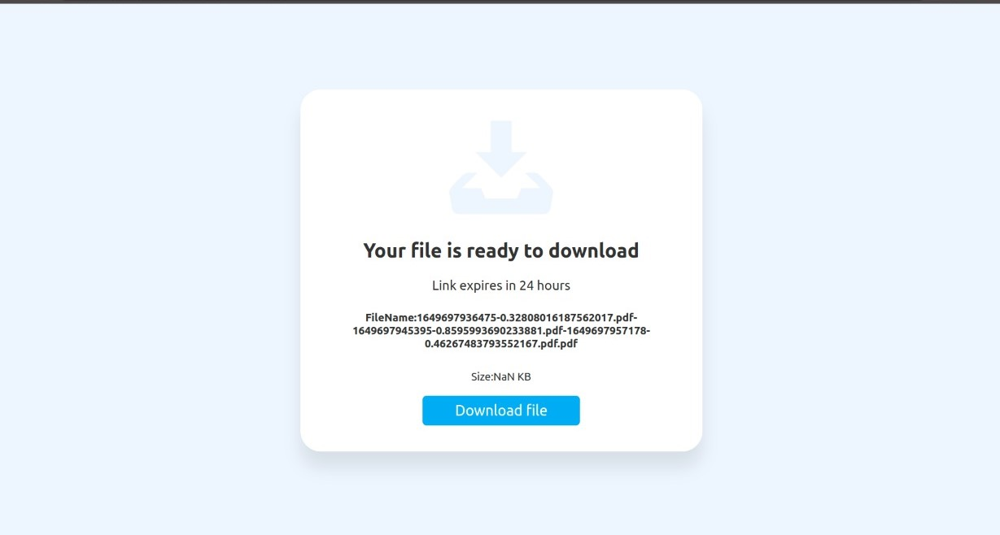

# Share-X
A File Sharing Service

<h4>Login Page<h4>
  

<h4>File Upload<h4>
  

  
<h4>Username<h4> 
  

  
<h4>User<h4>  
  

<h4>Inavlid OTP<h4>  
   

  
<h4>OTP sent<h4> 
  

  
<h4>All Sent Files<h4>  
  

  
<h4>Download Page<h4> 
  

  
<h4>Success Uploaded<h4>  
  

  
<h4>Success Sent<h4>   
  

  
<h4>Success Converted<h4> 
  

  
<h4>Conversion in Process<h4> 
  

  
<h4>Login Page<h4>   
  

  
<h4>Login Page<h4> 
  

  
<h4>Login Page<h4>  
  

